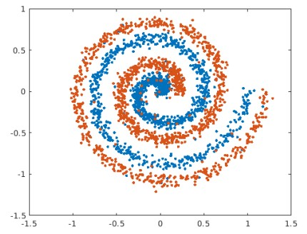

# Neural Network From Scratch

This project is an assignment from the course "Deep Learning" at BGU. The main purpose of this assignment is to implement a Neural Network from scratch, without any libraries like Tensorflow or PyTorch.

## The Goal Of This Project
The goal of this project is to gain an idea of how deep learning frameworks work behind the scenes. stuff like backward propagation, optimization, the influence of hyperparameters, and more.

## Details About The Project
The first part was to implement a standard neural network, that should make a classification of three different data sets.

The second part was to do the same, but with Residual NN instead of a standard neural network.

The project was written in Python language. the loops in Python are not efficient in terms of run-time, so we tried to avoid the usage of the loops and do a lot of stuff with matrix notations

## About The Datasets

We were used three datasets:

| Dataset            |                                                             |
| ----------------- |------------------------------------ |
|  SwissRoll | 
 |  GMM | 
 |  Picks | 
 
the SwissRoll data set is a 2-dimentional data looks like:

